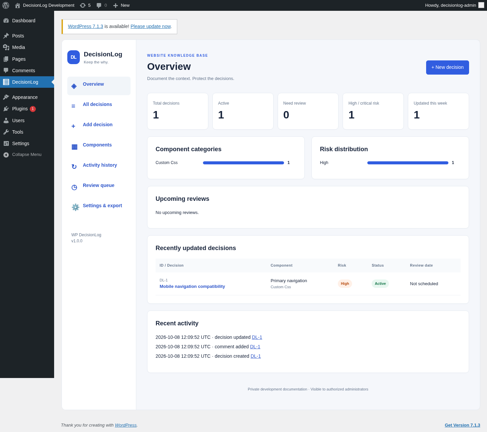
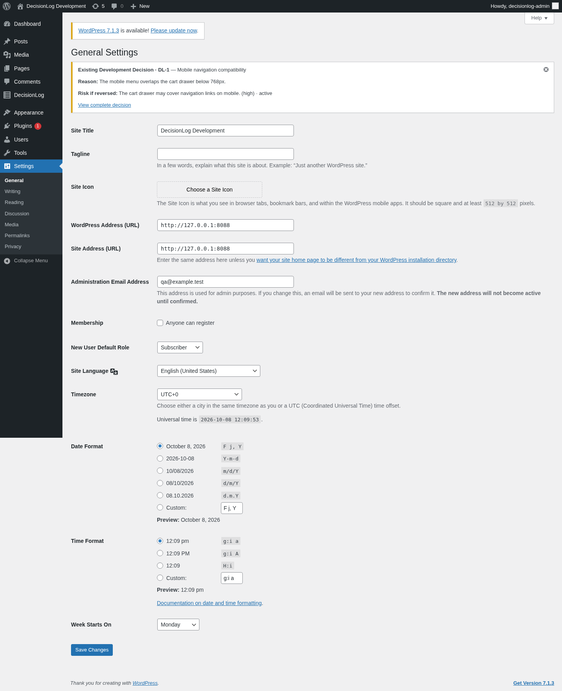
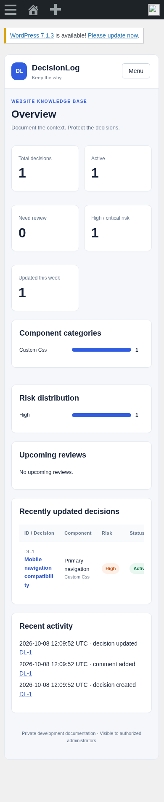

# WP DecisionLog

**Keep the why behind your WordPress changes.** Version 1.0.0 · Shazeel Ahmed · GPL-2.0-or-later

WP DecisionLog is private development documentation inside WordPress. Record what changed, why it mattered, and what could break if it is reversed. The next developer can see that context before touching supported settings, themes, plugins, Elementor documents, or WooCommerce configuration.

A CSS fix that looks unnecessary six months later may protect your mobile navigation. A DecisionLog record preserves its reason, author, risk, links, dependencies, and review history.

## Features

- Real database-backed React dashboard: statistics, category and risk charts, recent decisions, upcoming reviews, activity, component grouping, search, filters, and pagination.
- Decision creation, viewing, editing, archiving and deletion. Records include rationale, reversal risk, code stored as text, reference URL, notes, status, review date and author. Timestamped comments support follow-up discussion.
- Stable component links and nonblocking contextual notices on the explicitly supported screens in [the support matrix](docs/support-matrix.md). Notices are dismissible per administrator until the decision is updated.
- Metadata-only monitoring of allowlisted WordPress and WooCommerce options, theme switching, plugin activation/deactivation, Elementor document saves, and WooCommerce product post updates.
- Directed decision dependencies with cycle prevention and a linked relationship view.
- Daily WP-Cron reminders, an overdue/review queue, review completion, and optional deduplicated summary email.
- Private paginated audit history, JSON export/import with portable UUID relationships and comments, and CSV export with spreadsheet formula protection.
- Optional integrations: the core plugin activates and runs without Elementor or WooCommerce.
- Explicit data deletion setting; normal deactivation preserves records.

## Installation

1. Back up your site and try the plugin on staging first.
2. Upload **wp-decisionlog-v1.0.0.zip** through Plugins → Add New → Upload Plugin.
3. Activate the plugin on the individual site and open **DecisionLog** in the admin menu.
4. Add a decision. Add stable component links if you want contextual warnings and monitoring association.
5. Use Settings & export to configure reminders, monitoring and data retention.

Requires WordPress 6.4+, PHP 8.1+, and MySQL/MariaDB with InnoDB. The release ZIP includes all runtime PHP and compiled frontend assets. Site owners do **not** need npm or Composer. Network activation is deliberately rejected; activate separately per site on multisite. See [installation and operations](docs/installation.md).

## Screenshots

These images are captured from an actual local WordPress installation with a browser-created QA decision. They are not fabricated product mockups.





## Development

Node 20+, npm, Docker, and optionally local PHP 8.1+/Composer are required. Use the existing isolated checkout; a separate Git worktree is unnecessary.

```sh
npm ci
npm run build
npm test
composer install
composer lint
```

The JavaScript build uses esbuild and WordPress's `wp.element` implementation of `@wordpress/element`; it does not bundle a second React runtime. Source is under `src/`, release assets under `build/`. Composer packages are development-only.

For the reproducible Docker development installation:

```sh
bash scripts/dev-start.sh
bash scripts/check.sh
npm run test:browser # Requires Chromium; set CHROMIUM_PATH if needed.
python3 scripts/package.py
```

The development service binds only to loopback. It generates local database and administrator credentials outside the checkout, never puts credentials into source archives, and retains WordPress and database files under `/workspace/scratch/wpdl-dev`. See [TESTING.md](TESTING.md) for executed checks, prerequisites, and limitations. Integration tests **delete DecisionLog test data**: run them only on the disposable test installation with `WPDL_TEST_ALLOW=1`.

## Architecture

The bootstrap loads namespaced services from `includes/`, the admin shell from `admin/`, and independent public-hook adapters from `integrations/`. PHP owns validation, authorization and persistence. React renders private REST responses and sends the WordPress REST nonce for cookie-authenticated writes. See [architecture](docs/architecture.md).

## Database

Every table uses the actual `$wpdb->prefix`:

| Table suffix | Purpose |
| --- | --- |
| `decisionlog_decisions` | Decision fields, UUID, author and timestamps |
| `decisionlog_component_links` | Typed stable component identifiers |
| `decisionlog_dependencies` | Directed decision relationships |
| `decisionlog_activity` | Actor, time, event, related ID and safe metadata |
| `decisionlog_notifications` | Unique decision/review-date reminder markers |
| `decisionlog_comments` | Timestamped, authored plain-text discussion |

Schema versioning uses `wpdl_schema_version` and `dbDelta()`. Relational changes use InnoDB transactions. Unique keys prevent duplicate edges and reminder markers; dependency mutations use a database advisory lock to serialize graph writes. Complex relationships are not serialized into option blobs. JSON is used only for bounded audit metadata. See the index and integrity details in [architecture](docs/architecture.md).

## REST API

Namespace: `/wp-json/wp-decisionlog/v1/` (WordPress may use `?rest_route=` with plain permalinks). All endpoints require **both** `manage_options` and `manage_decisionlog`. Administrator role receives the plugin capability during activation.

CRUD, stats, components, activity, reviews, dependency replacement, review completion, exports/imports, comments, settings and warning dismissal are documented with request/response examples in [API reference](docs/api.md).

## Security and privacy

- No public decision endpoint. WordPress cookie authentication uses `X-WP-Nonce`; direct authenticated requests may use WordPress-supported authentication.
- Fixed SQL identifiers, prepared values, server-side enums/date/URL/size validation, escaped PHP output, and React text rendering.
- Code snippets are text. No snippets, PHP, imported code, or external references are executed.
- Audit events do not include option values, decision descriptions, comments, reasons or snippets. Configuration monitoring is strictly allowlisted.
- Only trusted administrators can import, export or configure destructive uninstall behavior. Imports are JSON only, bounded to 2 MiB/500 records and validated before writes. Existing UUIDs are skipped; files cannot overwrite existing records.
- CSV cells with formula prefixes are neutralized. JSON exports and database backups still contain private decision text: protect downloaded files and avoid recording secrets in decisions.
- No telemetry, payment hooks, remote executable imports, or arbitrary setting modification.

## Known limitations

This release supports a functional core workflow; it is not certified for every WordPress configuration or plugin. Contextual notices are screen-level warnings, not a universal unsaved-change interceptor or operation blocker. Widgets are linked by document ID plus Elementor widget ID; a document save conservatively flags widget-linked decisions without asserting that a particular widget changed. No automatic source-code diff, arbitrary option monitoring, inferred full dependency discovery, PDF export, or revision rollback is provided.

Elementor/WooCommerce support is based on public hooks and a documented allowlist. Full live optional-plugin editor/store validation requires those plugins and is reported separately in TESTING.md. WP-Cron timing depends on traffic; email delivery depends on the site's mail transport. Reminder markers intentionally prevent automatic resend after a failed mail attempt. Imports report partial errors if storage fails and never overwrite existing decisions; source author IDs and dates are informational on export and are reset to the importer/current time on import. Exports are limited to 5000 decisions and imports to 1000 comments per record. Deleted decision audit events retain the historical numeric ID. No automatic audit retention purge is performed. Network activation is unsupported.

## Roadmap

- Expanded live Elementor/WooCommerce version matrix and editor-specific UX validation.
- Translation catalogs and fuller frontend localization (current admin React labels are English).
- Import dry-run, larger streamed exports, dedicated audit retention controls, richer graph layout and optional PDF reports.
- Additional deliberately allowlisted component adapters and broader accessibility audit.

## License

Copyright Shazeel Ahmed. Licensed under GPL-2.0-or-later; see [LICENSE](LICENSE).
